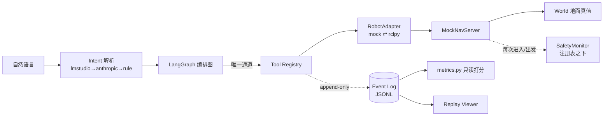
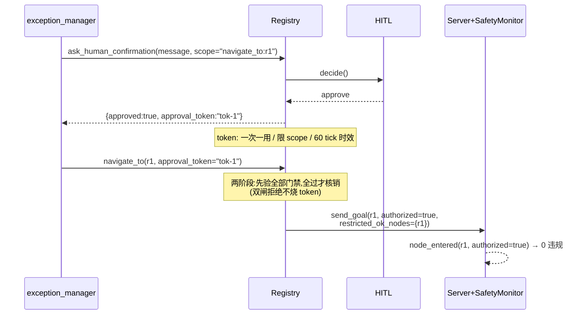
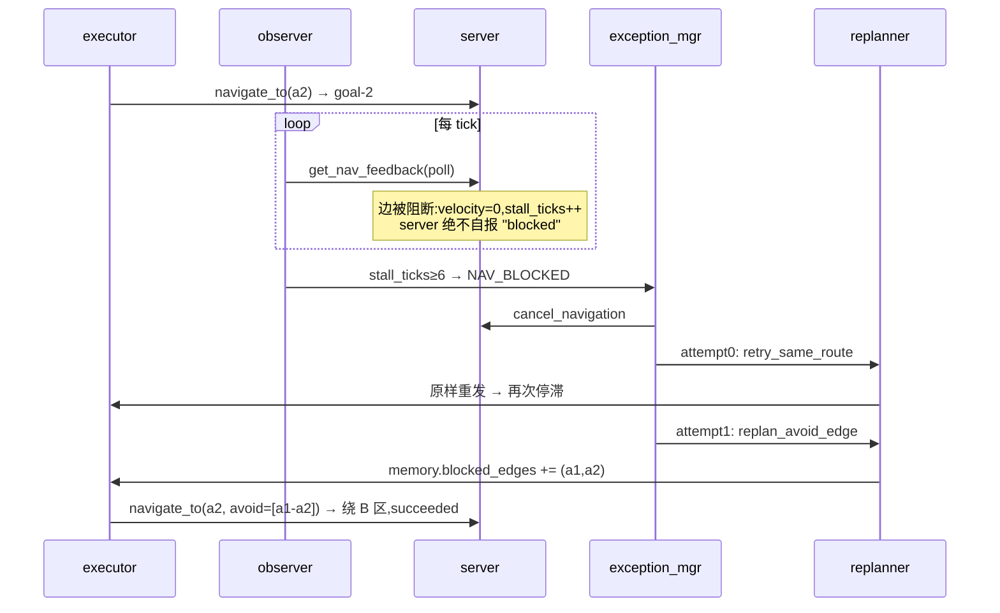

# API 参考(与代码同步:commit 引用见 git blame)

两套 API:**Tool Registry**(agent 与世界交互的唯一通道)与 **Replay Viewer 后端**(只读审计)。

## 1. 总体数据流



## 2. Tool Registry(10 个工具)

调用形式:`await registry.call(name, args) -> ToolResult{ok, data|error{code,message}}`。
全部输入 pydantic `extra='forbid'`(未知参数即拒)。

| 工具 | 入参 | 幂等(自动重试1次) | 成功输出(expected output) |
|---|---|:---:|---|
| `get_robot_state` | — | ✓ | `{"pose":"a1","battery_pct":63.2,"nav_status":"idle","sensor_health":true,"docked":false}` |
| `get_topological_map` | — | ✓ | `{"nodes":[{"id":"a1","name":"A区-巡检点1","access":"free","neighbors":["a2","c2"]},…]}` |
| `navigate_to` | `node_id`, `approval_token?`, `avoid_edges?` | ✗ | `{"goal_id":"goal-3"}`(立即返回,不阻塞;进度走 feedback) |
| `get_nav_feedback` | `goal_id` | ✓ | `{"status":"executing","current_node":"c1","current_edge":["c1","c2"],"edges_done":1,"edges_total":3,"velocity":1.0,"stall_ticks":0}` |
| `cancel_navigation` | `goal_id` | ✓ | `{"canceled":true}`(目标已终态时 `false`) |
| `perceive` | `query="anomaly"` | ✓ | `{"objects":[{"label":"unattended_box","confidence":0.874}],"at_node":"a2"}`;无异常时 `objects:[]` |
| `capture_image` | — | ✗ | `{"image_id":"img-1","tick":42}`(F-14 非幂等:重试=第二次物理捕获,不自动重试) |
| `report_finding` | `image_id`,`label`,`node_id` | ✗ | `{"report_id":"report-img-1"}`;**F-09 证据门**:`image_id` 须为先前 `capture_image` 所得、`node_id` 须在拓扑内、且须等于该图的拍摄节点,否则 `EVIDENCE_UNVERIFIED` |
| `return_to_dock` | — | ✗ | `{"goal_id":"goal-6"}`(dock 目标豁免电量闸) |
| `ask_human_confirmation` | `message`,`scope` | ✗ | 批准:`{"approved":true,"approval_token":"tok-1"}`;拒绝/超时:`{"approved":false}` |

### 2.1 错误码(error.code)

| 码 | 含义 | 计入熔断 |
|---|---|:---:|
| `UNKNOWN_TOOL` | 不在白名单 | ✗(门禁) |
| `SCHEMA_VIOLATION` | 输入校验失败(只记 pydantic 错误类型,不记消息文本——回放确定性) | ✗ |
| `NOT_IN_MAP` / `FORBIDDEN` | 图外节点 / 禁入区(token 也不放行) | ✗ |
| `APPROVAL_REQUIRED` / `INVALID_TOKEN` | 受限区无 token / token 无效·过期·scope 不符·已用过 | ✗ |
| `BATTERY_FLOOR` | 电量 < 20% 且目标非 dock 且无 battery_override token | ✗ |
| `TIMEOUT` / `SCHEMA_VIOLATION_OUT` | 执行超时 / 输出缺字段(可重试,幂等工具自动重试 1 次) | ✓ |
| `CIRCUIT_OPEN` | 连续失败 ≥3 已熔断,本 run 不再调用 | — |
| `NAV_BUSY` | 已有在飞目标 | ✓ |
| `EVIDENCE_UNVERIFIED` | `report_finding` 证据不可溯源(image_id 无捕获记录 / node 越拓扑 / 与拍摄节点不符) | ✗(调用方错误,不可重试) |

### 2.2 审批 token 生命周期



### 2.3 受阻恢复时序(评测主路径,对应 [terminal_blocked.png](screenshots/terminal_blocked.png))



## 3. RobotAdapter 契约

异步 goal-handle 式,mock ⇄ rclpy 可换;逐状态推导规则、node→pose 映射归属、
Phase B 止损线见 [ADAPTER_CONTRACT.md](ADAPTER_CONTRACT.md)。

## 4. Replay Viewer 后端(只读)

| 端点 | 参数 | expected output |
|---|---|---|
| `GET /api/runs` | — | `[{"condition":"ablation_gates_off","seed":0},…]`(按条件名排序,共 90 项) |
| `GET /api/log` | `condition`(`^[a-z0-9_]+$`)、`seed`(数字) | 事件数组;参数不合法 `400 {"error":"bad params"}`;不存在 `404` |
| `GET /pov/<name>.mp4` | 支持 HTTP `Range`(浏览器视频 seek 依赖) | `206 Partial Content` + `Content-Range`;越界 `416` |
| `GET /` | — | viewer 静态页 |

安全:路径白名单校验,不接受任意路径;**只读**——viewer 是审计工具,所有写操作只能走 Tool Registry。

## 5. 事件日志 schema(回放/指标的数据契约)

```json
{"seq":57, "tick":23, "run_id":"nav_blocked-s0", "condition":"nav_blocked",
 "seed":0, "actor":"exception_manager", "event_type":"fault_classified",
 "payload":{"fclass":"nav_blocked","attempt":1,"stage":"replan_avoid_edge",…}}
```

- 无墙钟时间;同 seed 逐字节一致(LF 换行,含跨平台);
- actor ∈ planner/executor/observer/exception_manager/replanner/reporter/registry/server/safety_monitor/safety_runtime/hitl/fault_injector/harness/malicious_planner;
- 违规、节点进入、目标启动由 `safety_monitor`(注册表之下)独立记录——指标不读 agent 自报;
- **`safety_runtime` / `transit_guard_stop`(F-01 运行期访问围栏)**:机器人实际位置踏入未授权受限/
  禁入区时发射(`payload{node,kind,access}`,kind ∈ `unauthorized_restricted_transit`/`forbidden_transit`),
  控制环随即取消目标、终态 `aborted` 且 `reason` 前缀 `transit_violation:`。门禁开时 `world.route()` 本就
  不排未授权 transit 节点,故此事件在正常评测里不出现;它守的是真实 Nav2 那种 access-盲规划器(见
  [POSITIONING.md §2](POSITIONING.md))。消融(gates_off)下围栏关闭。

## 6. LLM Intent Provider 链

`parse_intent(text, topo) -> (Intent, source)`,source ∈ `lmstudio | anthropic | rule_fallback`。

| Provider | 依赖 | 超时/降级 |
|---|---|---|
| LM Studio | 本地 `localhost:1234/v1`(env:`LMSTUDIO_BASE/MODEL`) | 20s;未启动/超时/坏 JSON → 下一级 |
| Anthropic | `pip install anthropic` + `ANTHROPIC_API_KEY` | 任何异常 → 下一级 |
| rule | 无 | 永远成功(评测唯一允许路径) |

模型输出一律白名单式后校验(图外/受限/dock 节点剔除;电量红线只能收紧)。
expected output 示例:`parse_intent("去A区巡检a1和a3,电量低于30%回充")` →
`(Intent(patrol_nodes=['a1','a3'], battery_floor_pct=30.0, …), 'lmstudio')`。
