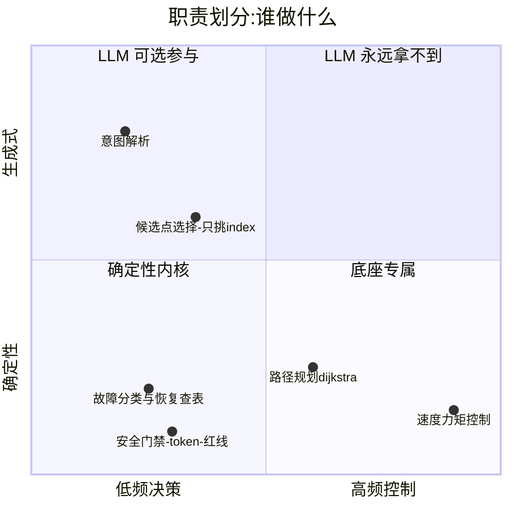

# 产品说明

## 1. 一句话定位

具身机器人 Agent 的**编排层**参考实现:LLM 只做高层意图,导航/感知/恢复由
**确定性 Tool + 状态机 + 预注册评测**兜底——回答"把 LLM 放进机器人,怎么保证它不闯祸、
且效果可度量"。

## 2. 目标用户与使用场景

| 用户 | 场景 | 对应物 |
|---|---|---|
| 面试候选人(作者) | 5 分钟现场讲解 + 实跑 | `run_demo.py` 各场景 + viewer 回放 + RESULTS 表 |
| 面试官/技术评审 | 快速审计"数字是不是真的" | git 历史(prereg 先于结果)+ runs/ 日志 + metrics.py 只读打分 |
| 机器人团队工程师 | 评估该编排模式可否落地 | ADAPTER_CONTRACT.md(mock→rclpy 切换契约)+ 安全门禁设计 |

## 3. 能力边界(产品化视角)

- **做**:意图→任务队列、故障检测(水位)、恢复链、HITL 审批、全程留痕、预注册评测;
- **不做**:底盘控制、SLAM、真实感知(perceive 是结构化 mock)、多机调度;
- **诚实边界**:仿真 demo,无实机;battery/sensor/tool 故障注入 mock-only。

## 4. 差异化(为什么不是又一个 agent demo)

1. **评测优先**:预测先 commit、结果后跑分(git 时间戳可验),未恢复 case 原样报;
2. **安全指标是活的**:对抗条件证明门禁 6/6 拦截,消融条件证明关掉门禁违规立现——
   "安全来自确定性层"是因果结论不是口号;
3. **违规不自评**:地面真值监视器在注册表之下独立记账;
4. **可回放**:同 seed 事件流逐字节一致,viewer/CLI 双通道回放;
5. **LLM-optional**:评测环路 0 次 LLM 调用;live demo 走本地 LM Studio,断网降级规则。

## 5. 路线图(每步等上一步证明价值)

| 阶段 | 内容 | 为什么等 |
|---|---|---|
| ✅ Phase A(本仓库) | mock 底座上全闭环 + 评测 | 先证明编排层本身站得住 |
| Phase B | WSL2/Docker + TurtleBot3/Nav2,换 rclpy adapter | 契约已写死(ADAPTER_CONTRACT),止损线预注册:day4 13:00 见不到 `/navigate_to_pose` 即放弃 |
| Phase C | 真实感知(VLM)替换 perceive mock | 需先有 Phase B 的真实传感数据流 |
| Phase D | 跨 run 记忆作为显式实验条件 | 需重新预注册(记忆污染 seed 独立性) |

## 6. 已知限制

见 [README「已知限制(诚实清单)」](../README.md#已知限制诚实清单)——受阻边永不遗忘、
单 token 双闸、复合故障致死面等,连同复审(35 项证实)与修复记录一并公开。
