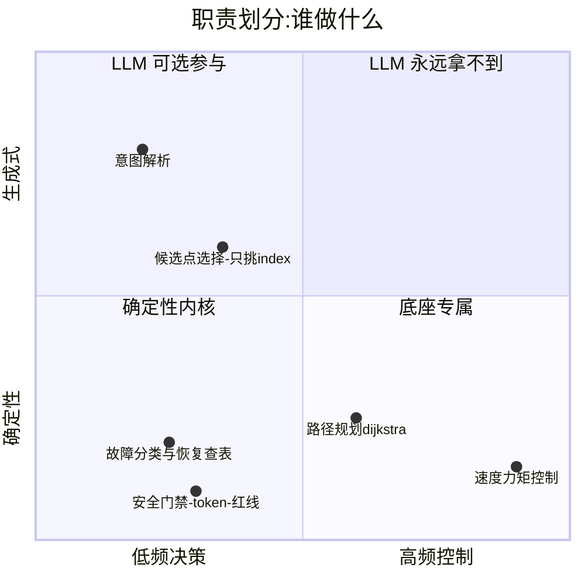

# 产品说明

## 1. 一句话定位

具身机器人 Agent 的**编排层**参考实现:LLM 只做高层意图,导航/感知/恢复由
**确定性 Tool + 状态机 + 预注册评测**兜底——回答"把 LLM 放进机器人,怎么保证它不闯祸、
且效果可度量"。

## 2. 目标用户与使用场景

| 用户 | 场景 | 对应物 |
|---|---|---|
| 面试候选人(作者) | 5 分钟现场讲解 + 实跑 | `run_demo.py` 各场景 + viewer 回放 + RESULTS 表 |
| 面试官/技术评审 | 快速审计"数字是不是真的" | git 历史(prereg 先于结果)+ runs/ 日志 + metrics.py 只读打分 |
| 机器人团队工程师 | 评估该编排模式可否落地 | ADAPTER_CONTRACT.md(mock→rclpy 切换契约)+ 安全门禁设计 |

## 3. 能力边界(产品化视角)

- **做**:意图→任务队列、故障检测(水位)、恢复链、HITL 审批、全程留痕、预注册评测;
- **不做**:底盘控制、SLAM、真实感知(perceive 是结构化 mock)、多机调度;
- **诚实边界**:仿真 demo,无实机;battery/sensor/tool 故障注入 mock-only。

## 4. 差异化(为什么不是又一个 agent demo)

1. **评测优先**:预测先 commit、结果后跑分(git 时间戳可验),未恢复 case 原样报;
2. **安全指标是活的**:对抗条件证明门禁 6/6 拦截,消融条件证明关掉门禁违规立现——
   "安全来自确定性层"是因果结论不是口号;
3. **违规不自评**:地面真值监视器在注册表之下独立记账;
4. **可回放**:同 seed 事件流逐字节一致,viewer/CLI 双通道回放;
5. **LLM-optional**:评测环路 0 次 LLM 调用;live demo 走本地 LM Studio,断网降级规则。

## 5. 路线图(每步等上一步证明价值)

> 定位与"VLA 挂在哪一层"见 [POSITIONING.md](POSITIONING.md);恢复归属见 [RECOVERY_OWNERSHIP.md](RECOVERY_OWNERSHIP.md)。

| 阶段 | 内容 | 状态 / 为什么 |
|---|---|---|
| Phase A(本仓库) | mock 底座上全闭环 + 90 条预注册评测 | ✅ 已完成——先证明编排层本身站得住 |
| Phase B | 换 rclpy adapter 接真实 ROS 2 / Nav2(容器 + loopback_sim),故障用 keepout 注入 | ✅ 已完成,实测见 [phase_b/FINDINGS.md](../phase_b/FINDINGS.md) |
| Phase C | 预注册故障注入评测从 mock 搬到真实 Nav2(可移植条件),mock⇄real 对比 | ✅ 已完成,见 [phase_c/PHASE_C_RESULTS.md](../phase_c/PHASE_C_RESULTS.md) |
| Phase D(纯仿真) | `execute_vla_skill` + 异步 action-chunk runtime + **独立 Safety Shield** + mock VLA policy;把"安全监管一个 learned policy"接进现有 registry + 共享事件日志;端到端复合任务(导航→VLA 抓取→校验→归坞)+ Skill Supervisor 恢复归属 | ✅ 已完成,见 [phase_d/README.md](../phase_d/README.md) 与 [phase_d/PHASE_D_RESULTS.md](../phase_d/PHASE_D_RESULTS.md)(18 项测试全过)。诚实边界:mock policy + 运动学 sim,非真 VLA/非物理;**且为垂直切片非完整集成契约**——skill 为阻塞调用(无外部 goal/feedback/cancel)、shield 令牌可 import 绕过、postcheck 复用 skill success、composite 未并入正式 LangGraph graph(D1/D2 待办,不需硬件) |
| Phase E+(需硬件) | 真臂 + 遥操作数据 + SmolVLA/ACT 微调 + 真实闭环 eval + intervention 数据飞轮;真实 VLM 感知进控制闭环;跨 run 记忆作为显式实验条件 | 需要真机械臂 / GPU / 相机,不在当前范围;如实标注为未来 |

## 6. 已知限制

见 [README「边界」](../README.md#边界)——受阻边在 run 内持续不可用、单 token 双闸、
复合故障致死面等;复审(35 项证实)与修复记录见 [REVIEW.md](../REVIEW.md) 和
[EVAL_PREREG.md 重跑记录](../EVAL_PREREG.md)。
