# 用户手册

面向:要在自己机器上跑通、并在面试/评审现场演示这个 demo 的人。零 ROS 环境要求。

## 1. 安装(一次性,约 2 分钟)

```powershell
cd embodied-agent-demo
python -m venv .venv
.\.venv\Scripts\python -m pip install -r requirements.txt
$env:PYTHONUTF8 = 1        # 中文 Windows 必设(GBK 控制台防线)
```

验证:`.\.venv\Scripts\python -m pytest tests -q` → **expected output:`34 passed`**。

## 2. 终端演示(`run_demo.py`)

| 命令 | 演示内容 | expected output(节选) |
|---|---|---|
| `python run_demo.py` | 基线巡检 | `任务结束 —— terminal=ok 巡检=['a1','a2','a3','dock'] 上报=1` |
| `python run_demo.py --scenario blocked` | 受阻→水位检测→绕行 | 见下图:`stagnation` → `retry` → `avoid_edge` → 绕 B 区成功 |
| `python run_demo.py --scenario battery` | 低电量→回坞→断点续跑 | `队列快照(5 步)→ 回坞充电` → `断点续跑:恢复 5 步` |
| `python run_demo.py --scenario restricted --interactive` | 受限区 HITL 审批 | 控制台出现 `批准吗?(y/N):`,输入 y → `已进入 r1(…违规数=0)` |
| `python run_demo.py --nl "去A区巡检a1和a3" --llm` | LM Studio 意图解析 | `意图解析(provider=lmstudio):{'patrol_nodes': ['a1','a3'], …}` |

受阻场景完整输出(截图,含每一步恢复决策):

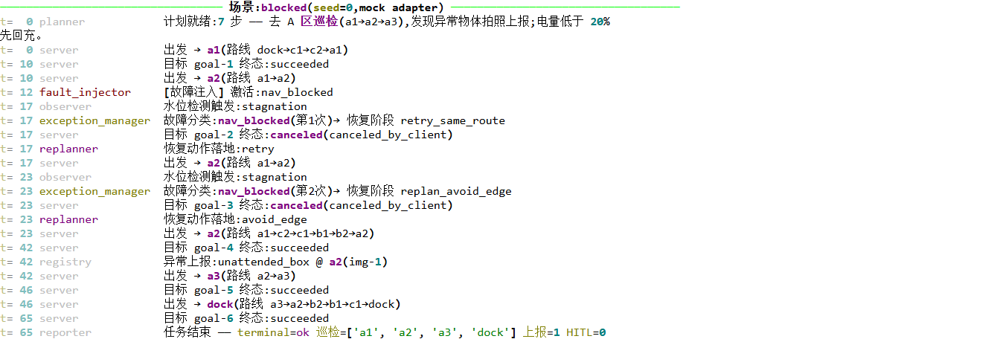

低电量回坞续跑:

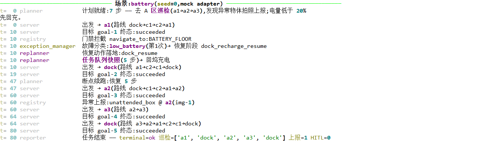

受限区审批(token 一次一用):

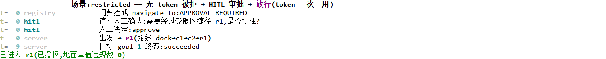

`--tick 0.12` 控制播放节奏(默认);`--tick 0` 瞬时跑完;`--seed N` 换随机性。

## 3. 评测(`run_eval.py`)

```powershell
python run_eval.py
```

**expected output:**`完成 90 个 run。` + `结果表已写入 RESULTS.md`,约 10~20 秒。
注意:工作树必须干净(预注册协议强制),否则拒跑并提示。
结果解读见 [RESULTS.md](../RESULTS.md),口径定义见 [EVAL_PREREG.md](../EVAL_PREREG.md)。

## 4. 回放 Viewer(前端)

```powershell
python viewer\serve.py          # expected: replay viewer: http://127.0.0.1:8777
```

浏览器打开 `http://127.0.0.1:8777`:

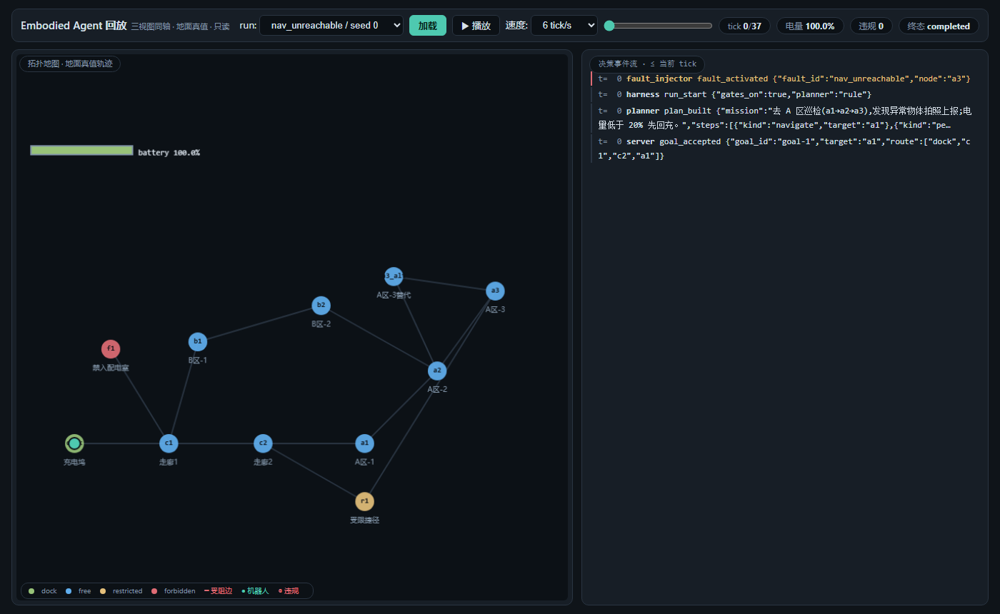

### 4.1 控件逐个说明(控制条)

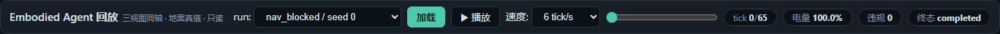

| 控件 | 类型 | 行为 | expected output |
|---|---|---|---|
| `run` 下拉框 | select(form) | 列出全部 90 个 run(条件/seed) | 打开即有 90 项,首项 `ablation_gates_off / seed 0` |
| `加载` | button(主) | 从后端拉取该 run 事件日志 | tick 计数变为该 run 总 tick(如 nav_blocked/0 → `65`) |
| `▶ 播放` | button | 开始逐 tick 动画;再点暂停 | 按钮文本切换为 `⏸ 暂停`,机器人沿边移动 |
| 速度下拉 | select | 2/6/12/30 tick 每秒 | 动画速度即时变化 |
| tick 滑杆 | range(form) | 拖到任意时刻(自动暂停) | canvas 与事件流同步到该 tick |
| 电量 chip | 只读 | 已知最近电量 | 低于 20% 时 canvas 电量条变红 |
| 违规 chip | 只读 | ≤当前 tick 的地面真值违规数 | 正常条件恒 0;消融 run 递增至 5 |

### 4.2 Canvas(拓扑地图)状态

| 状态 | 截图 | 看点 |
|---|---|---|
| 初始 t=0 | 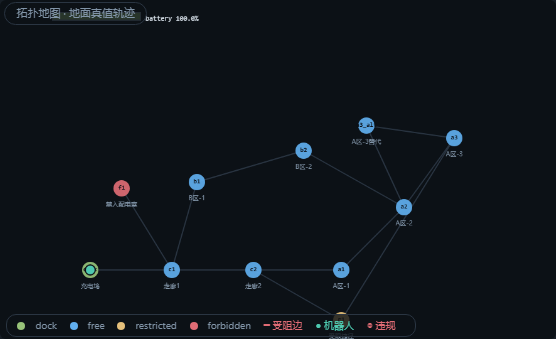 | 机器人(青点)在 dock;节点按访问级配色(绿=dock,蓝=free,黄=restricted,红=forbidden) |
| 受阻恢复中 | 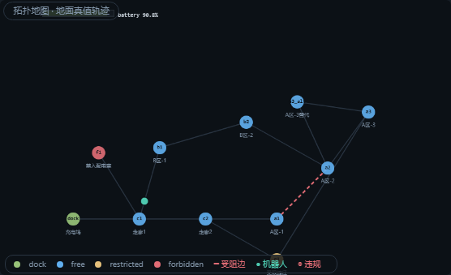 | a1–a2 变红色虚线(故障注入),机器人正走 B 区绕行路线 |
| 低电量 | 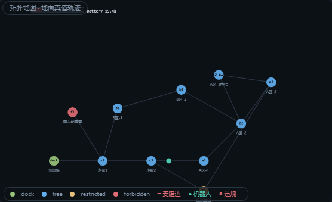 | 左上电量条黄→红,随后可见回坞轨迹 |
| 消融违规 | 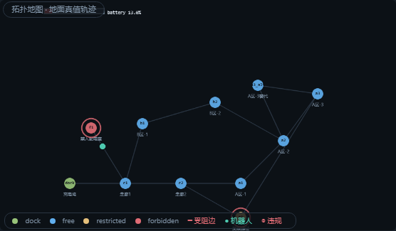 | 违规节点红圈扩散闪烁(f1/r1),违规 chip 递增 |

### 4.3 事件流面板

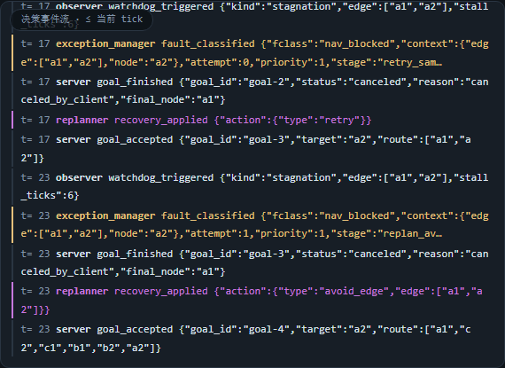

只显示决策级事件(≤当前 tick),按 actor 配色:红=故障注入/安全监视,黄=异常管理,
紫=重规划,青=HITL,绿=报告。数据即 `runs/**.jsonl` 原文,无二次加工。

## 4.4 三视图指挥台布局(POV + 拓扑 + 事件流,单屏同轴)

有预渲染 POV 视频的 run(`viewer/pov/<condition>_seed<N>.mp4`,现有 nav_blocked/
low_battery/ablation_gates_off 各 seed0)自动进入**三视图模式**,共用同一根 tick 时间轴,
整页单屏容纳、无页面滚动(联调断言锁定):

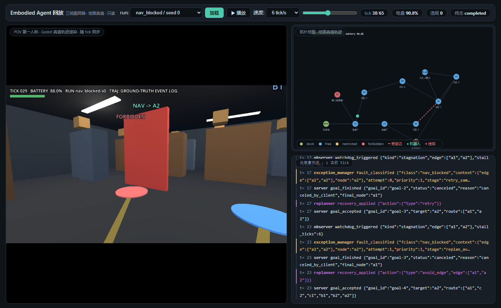

| 区域 | 比例 | 内容 |
|---|---|---|
| 控制条 | 全宽 ~48px | 标题 + run 选择 + 播放控制 + tick/电量/违规/终态 chips |
| 左列 | 58%,跨两行 | POV 第一人称(黑底等比 contain,随 tick 逐帧同步,偏差 <0.2s) |
| 右上 | 42% × 46% | 拓扑地图(canvas 等比缩放,图例悬浮左下) |
| 右下 | 42% × 54% | 决策事件流(面板标题固定,内部滚动,按 actor 配色) |

无 POV 视频的 run 自动退化为**双栏**:拓扑升为左侧 hero(58%)+ 事件流右栏(42%)。
消融 run 的 POV 在每次地面真值违规时全屏红闪。

## 4.5 POV 第一人称视频(可选,视觉演示)

任意 run 可渲染成机器人第一人称视角(Godot 4 headless,依赖 gamecraft-runner 容器),
详见 [povgen/README.md](../povgen/README.md)。**expected output:**`POVGEN_DONE 335` +
`frames/*.png` → `clip_pov.mp4`;受阻凝视与 VLM 叠加效果见
[pov_blocked.png](screenshots/pov_blocked.png) / [pov_perceive.png](screenshots/pov_perceive.png)。

## 5. 命令行回放(无浏览器场景)

```powershell
python -m embodied_agent.replay runs\compound\seed_0.jsonl
```

**expected output:**决策事件表(t=9 电量抢占 → t=12 受阻激活 → … → `battery_dead`)。

## 6. LM Studio(可选,本地 LLM 意图解析)

1. 打开 LM Studio → 加载任意 chat 模型(默认找 `qwen2.5-3b`)→ 启动本地服务(端口 1234);
2. 换模型:`$env:LMSTUDIO_MODEL = "qwen2.5-1.5b"`;换地址:`$env:LMSTUDIO_BASE`;
3. **不装也完全能用**:provider 链自动降级到规则解析,评测本来就不依赖 LLM。

## 7. 故障排查

| 症状 | 原因 | 解法 |
|---|---|---|
| 中文乱码 / UnicodeEncodeError | GBK 控制台 | `$env:PYTHONUTF8 = 1`;用 Windows Terminal |
| `langgraph` import 炸 | 全局环境版本冲突 | 用项目 `.venv`(见 §1),勿用全局 Python |
| run_eval 拒跑 | 工作树不干净 | 先 commit(预注册协议,故意的) |
| viewer 下拉框空 | 还没跑过评测 | 先 `python run_eval.py` 生成 runs/ |
| `--llm` 走了 rule_fallback | LM Studio 未启动/超时 | 属预期降级;启动 LM Studio 本地服务即可 |
