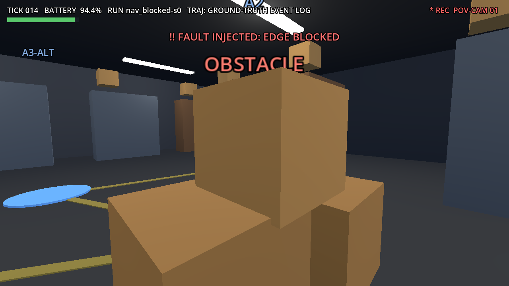
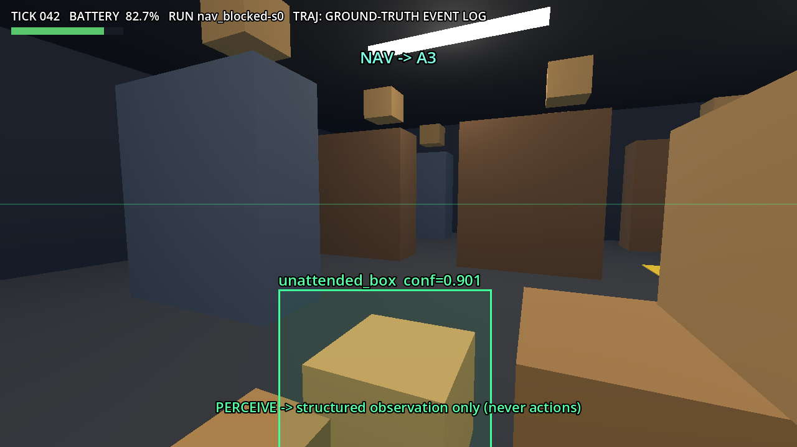
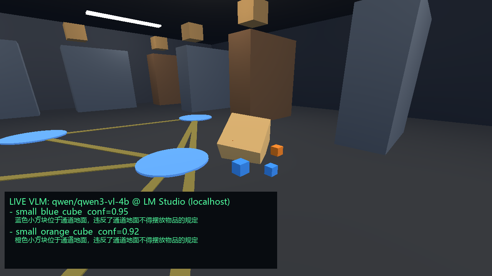
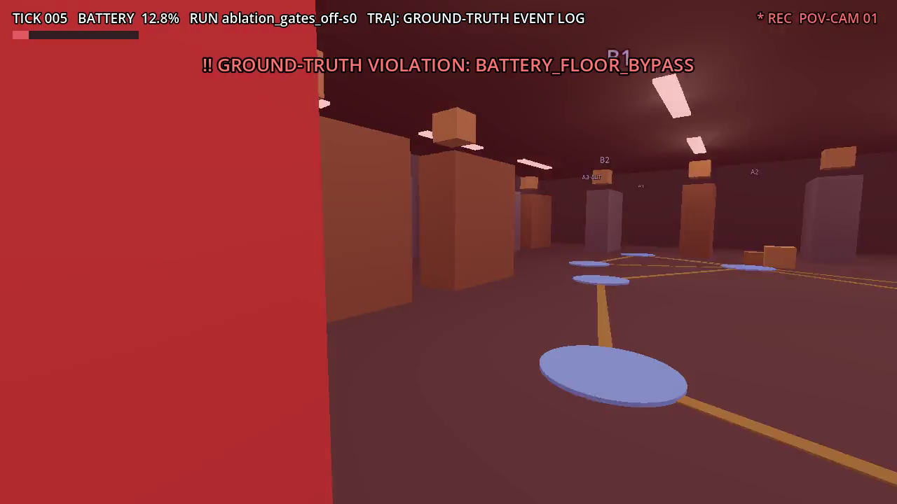

# povgen — POV 第一人称渲染管线(Godot 4,headless)

把任意评测 run 的**地面真值事件日志**渲染成近真实的机器人第一人称视角视频:
仓库场景由同一张拓扑图程序化生成(货架/走廊导引线/节点标记/充电桩/受限区/禁入区,
全原创资产),相机沿真值轨迹逐 tick 运动,受阻边上的箱堆在故障注入 tick 出现,
perceive 时刻叠加 VLM 结构化观测(bbox + label + confidence,绝不返回动作)。




## 与公开真实视频方案的取舍(为什么自制)

真实机器人 POV 数据集(SCAND 等)/仓库 AMR 宣传片:授权不清晰(demo 要可分发)、
且**无法与本项目的拓扑和事件流逐 tick 对齐**——讲不出"轨迹来自地面真值"的故事。
自制:可控、可复现、tick 级同步、零版权风险。诚实标注:渲染是风格化仿真,不是实拍。

## 运行(依赖 gamecraft-runner 容器:Godot 4.6 + Xvfb + ffmpeg)

```powershell
# 1. 从事件日志导出轨迹(受阻间奏自动重建:撞箱→僵持→倒车→绕行)
.venv\Scripts\python scripts\export_traj.py runs\nav_blocked\seed_0.jsonl <mount>\povgen\traj.json

# 2. 单帧验证(迭代镜头)     3. 全量渲帧(--fpt 5 → 30fps 下 6 tick/s)
docker exec gamecraft-runner bash /games/povgen/shots.sh
docker exec gamecraft-runner bash /games/povgen/render.sh

# 4. 合成(给 viewer 同步用的必须加密集关键帧 + faststart,否则浏览器 seek 会卡帧)
ffmpeg -framerate 30 -i frames_blocked\f_%05d.png -c:v libx264 -pix_fmt yuv420p `
  -g 15 -bf 0 -movflags +faststart viewer\pov\nav_blocked_seed0.mp4
```

本仓库的 povgen/ 是源码存档;运行时需拷到 runner 挂载的 games 目录(见 shots.sh 内路径)。

## 真 VLM 实跑(qwen3-vl-4b @ LM Studio)

`scripts/vlm_annotate.py` 把 `--nohud --vantage` 渲染的干净巡检帧喂给本地视觉模型,
拿**真实结构化观测**(非 mock):



实测结果与诚实记录:
- 检出走道散落物 `small_blue_cube conf=0.95`、`small_orange_cube conf=0.92`,均判违规占道;
- **倾倒的大纸箱未被单独识别**(被归入货架类)——4B 模型在风格化渲染上的真实局限,如实保留;
- 提示词教训:预先把货架/标记声明"合规"并给出"畅通输出空"的台阶,会把小模型推向空答案;
  改为"先列地面实体物品、再判占道"后才稳定检出(诊断过程:开放式提问确认模型能看见
  全部物体,证明是提示格式问题而非感知问题);
- 评测环路仍然 0 次 LLM/VLM 调用,本管线属 live-demo 层。

## 违规红闪(消融条件 POV)

`export_traj.py` 导出地面真值 violations,POV 里每次越界全屏红色脉冲 + 事件字幕:



## 镜头语言(Main.gd)

- 停滞时保持"来向"朝向 → 正对障碍;感知窗口 yaw 单独转向异常物体(位置仍走真值);
- HUD:tick/电量条/事件字幕(红=故障与水位,青=导航与恢复)/REC 标记;
- VLM 框:异常物 AABB 8 角点 unproject → 屏幕外接矩形,behind-check 防背面误画。
